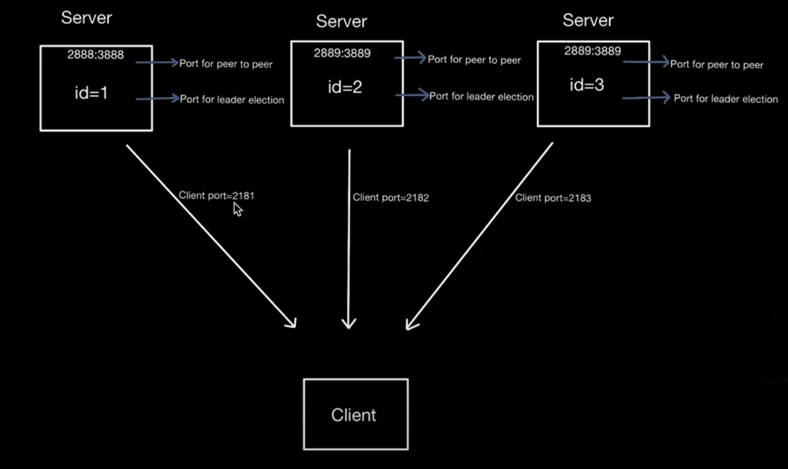
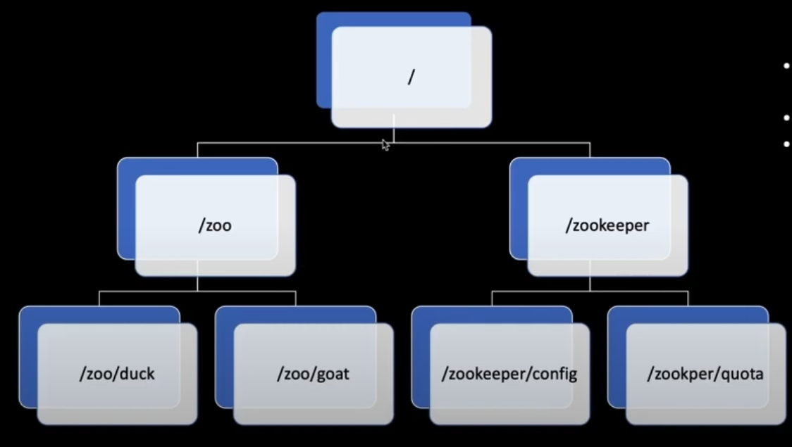

##### MultiNode
- Min recommended is 3. Most common production setup is 5.
- The number of node should be odd.
- The replicated group of servers is called quorum.
- Zookeeper servers run as leader-follower node. If leader failed, a new leader is elected.

#### config
server.1=<hostname>:<peertopeerport>:<portforleadeelection>
server.1=zoo:2888:3888


### Setup

#### Start Zookeeper Cluster
```bash
docker compose up --build -d
```

#### Start Client (CLI)
```shell
./apache-zookeeper-3.9.3-bin/bin/zkCli.sh -server localhost:2181,localhost:2182,localhost:2183
```

#### Server status
```shell
./apache-zookeeper-3.9.3-bin/bin/zkServer.sh status ./apache-zookeeper-3.9.3-bin/conf/zoo.cfg
```





#### ZNode
- Data: string, max 1mb, recommended to be small
- Path:: / seperated path from root node to present node. All characters allowed except .
- ACL: allowed users/groups
- Stats information: version number, timestamps etc
- ZNode type is set at creation time and cannot be changed.

###### Types
1. Persistent
- Have life unless 8it is deleted
```shell
create /persistentNode1 "data"
```
```shell
get /persistentNode1
```

```shell
create /persistentNode1/child1 "i'm child  of persistent node"
```

######## Delete
- Delete all child then delete parent
```shell
delete /persistentNode1/child1
```
```shell
delete /persistentNode1
```

2. Ephemeral
- It is deleted the moment creating client session ends OR any of the authorized clients explicitly delete it.
- Session end can happen due to connection close by client OR client crash.
- Is not allowed to have children. (due to frequent deletion of node/parent after timeout)
- Can be used when servers need to know each other's state.
- Analogous to client joining & leaving the distributed cluster

````shell
create -e /ephemeralNode1 "data"
````

````shell
get /ephemeralNode1
````

3. Sequential (can be either persistent or ephemeral)
- Assigned a sequence number in the name during creation.
- the sequence number is monotonically increasing with padding of zero.
- The sequential node can be used to implement distributed global queue as sequence number can impose global ordering.
- The parent node maintains the sequence number.

```shell
    create -s /seq "sequence data"
```

```shell
    create -s /root/seq "sequence data"
```

4. Ephemeral Sequential Node
```shell
create -s -e /root/seq "ephemeral sequential"
```